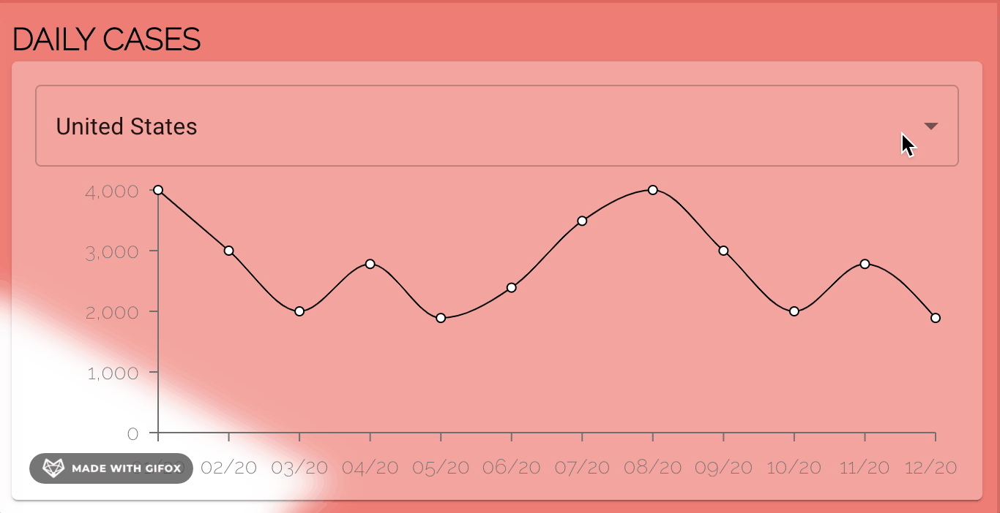
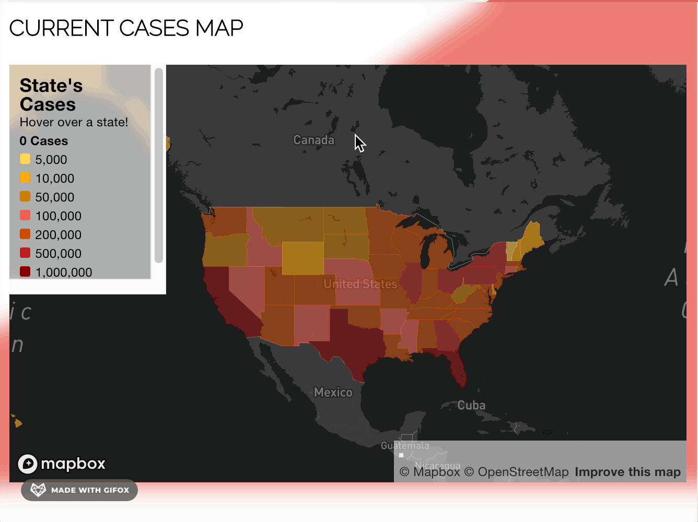
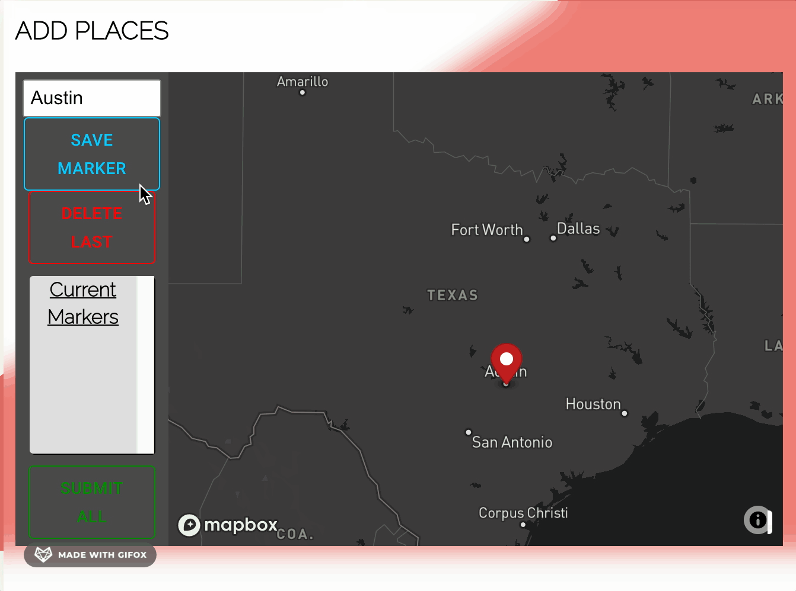

# Project Title: 
### Roaming For Rona

# Deployment

[roaming-rona-fork on Heroku](https://roaming-rona-fork.herokuapp.com/)

# Project Description: 
This project aims to create an application that informs users about everything they need to know to take precautions against COVID-19. Our application provides local (San Francisco) testing sites if a user needs a test. Users can also track their testing history by submitting their results to our application's database. If a user has tested positive, they can mark places showing where they might have transmitted COVID-19 before receiving a positive test result. This information is then shared with all users of our application to remain informed about potential transmission. This app would be handy for showcasing possible hot spots in a user's area, helping them learn certain places to avoid. The application also provides daily updates regarding the United States' current caseload. A user could also track the history of their state's caseload. Check out our application's highlights below.
# Table of Contents
* Installation
* Usage
* Application Highlights
* Data Sources
* Contact us
# Installation: 
To install necessary dependencies, run the following command:
npm i
# Usage: 
What to know about using the repo: To run the application, you must have node installed. 
# Application Highlights
View the current cases of COVID-19 by US State.

Compare states' cases per million residents with an interactive choropleth map (Made with Mapbox GL JS).

Did you test positive for COVID-19? Keep track of your test results on our application.

Add Locations to our database to show places you have recently visited. 

Once you're done adding locations to the database, you can view all of the user-added locations.This helps users know if they have been in contact with the virus if they have been to the same location as you in the past 10 days. 

If you are showing symptoms, or if you had been in contact with the virus, get tested! Our app will help you find a test (Local to San Francisco).

# Data Sources
- Real-Time caseload data is sourced from the New York Times. We pull the data from [disease.sh API](https://disease.sh/docs).
- Testing Sites information is sourced from [DataSF](https://datasf.org/opendata/).

- Test Results and Locations on the Cluster Map are added by our users. Locations data are stored in our Mongo DataBase and expire after 10 days. 

# Contact Us:
If you have any questions about the repo, open an issue or contact
the team directly at any of the following emails: harb3gaucho@gmail.com, prasb.03@gmail.com, marcos.joseph.garcia@gmail.com, campbelllm@gmail.com.
